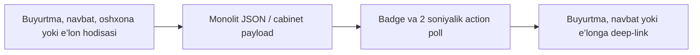

# K19 — bildirishnomalarni modulga migratsiya qilish

## Monolitdagi oqim

Tegishli `static/index.html` qismlari:

- 2665–2706: bildirishnomalar va e’lon filtrlari ekrani;
- 7530–7703: ro‘yxatni yuklash, badge, o‘qildi qilish, action banner,
  deep-link va filtr amallari;
- `api.py` 9684–9744: push qurilma/sozlama endpointlari;
- `api.py` 9745–9808: bildirishnoma endpointlari;
- `api.py` 10827–10874: e’lon filtrlarini moslashtirish.



Monolitda ro‘yxat, push preference va e’lon filtrlari generic JSON bilan birga
saqlangan. Action talab qiladigan xabarlar har ikki soniyada tekshirilgan.

## Moduldagi oqim

```mermaid
flowchart LR
  E[Domain hodisasi]
  S[NotificationService]
  N[(notifications)]
  P[(preferences / filters / devices)]
  O[(push_outbox)]
  A[/api/v1/notifications]
  R[React NotificationsV1656]
  D[Typed deep-link]
  E --> S --> N
  S --> P
  N --> O
  N --> A --> R --> D
```

Ko‘chirilgan qismlar:

- `backend/app/notifications/model.py`: relational preference, filter, qurilma,
  push outbox va typed deep-link ustunlari;
- `backend/app/notifications/repository.py`: idempotent yozish, o‘qildi qilish,
  staff visibility va push navbati;
- `backend/app/notifications/service.py`: user/business/staff qoidalari va yangi
  pullik e’lonni filtrlarga moslashtirish;
- `backend/app/notifications/push_worker.py`: Firebase yuborish, atomik claim,
  vaqt oralig‘idagi retry va yaroqsiz qurilmani o‘chirish;
- `backend/app/notifications/router.py`: typed REST API;
- `frontend/src/notifications/NotificationsV1656.tsx`: user va biznes uchun
  yagona ekran, action banner va deep-link;
- `0033_notifications_v1656`: eski `cabinet_records` hamda
  `cabinet_payload` ma’lumotlarini idempotent backfill.

## Cutover qoidasi

Eski monolit kodini faqat quyidagilar bajarilgach olib tashlash mumkin:

1. `0033_notifications_v1656` ishlab chiqarish bazasida muvaffaqiyatli ishlaydi;
2. user, business va staff oqimlarining typed API metrikalari barqaror bo‘ladi;
3. buyurtma, navbat, dining va e’lon deep-linklari parity testlardan o‘tadi;
4. push outbox worker real Firebase credential bilan alohida yoqiladi;
5. kamida bitta release davomida generic JSON fallback ishlatilmayotgani tasdiqlanadi.

K19 eski payload kalitlarini o‘chirmaydi. Shu sabab deploy qaytarilsa eski monolit
o‘qish oqimi ishlashda davom etadi; monolitni olib tashlash alohida cutover bo‘ladi.
