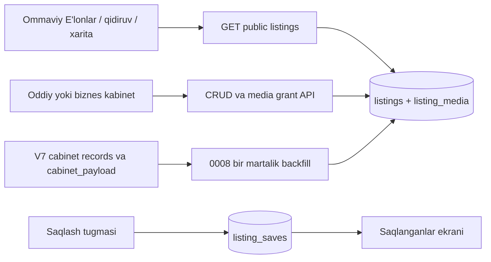

# E'lonlar v1656 paritet auditi

Haqiqat manbai: `static/index.html` (v1656). Ushbu audit reklama ekranlarini
qamramaydi; faqat ommaviy va kabinetdagi E'lonlar oqimini qamraydi.

| Ekran | Holat | React fayli | Monolit qatorlari | Test fayli |
|---|---|---|---|---|
| `listings` — toifalar va e'lonlar ro'yxati | migrated | `frontend/src/listings/PublicListingsV1656.tsx` | HTML `1594–1601`; mantiq `3691–4055` | `frontend/src/listings/ListingsV1656Parity.test.tsx` |
| `list` — ommaviy e'lon tafsiloti | migrated | `frontend/src/listings/ListingPageV1656.tsx`, `ListingDetailV1656.tsx` | HTML `1655–1657`; mantiq `3939–4055`, `7763–7782`, `8594–8604` | `frontend/src/app/App.test.tsx`, `frontend/src/listings/ListingsV1656Parity.test.tsx` |
| `cab-elon` — biznes e'lonlari | migrated | `frontend/src/listings/OwnerListingsV1656.tsx` | HTML `2142–2156`; mantiq `13214–13229`, `13580–13855` | `frontend/src/profiles/Profiles.test.tsx`, `frontend/src/listings/ListingsV1656Parity.test.tsx` |
| `cab-elon-form` — biznes e'lon joylash | migrated | `frontend/src/listings/ListingFormV1656.tsx` | HTML `2196–2220`; mantiq `13580–13855` | `frontend/src/listings/ListingsV1656Parity.test.tsx` |
| `ucab-elon` — foydalanuvchi e'lonlari | migrated | `frontend/src/listings/OwnerListingsV1656.tsx` | HTML `2434–2448`; mantiq `13214–13229`, `13580–13855` | `frontend/src/profiles/Profiles.test.tsx`, `frontend/src/listings/ListingsV1656Parity.test.tsx` |
| `ucab-elon-form` — foydalanuvchi e'lon joylash | migrated | `frontend/src/listings/ListingFormV1656.tsx` | HTML `2488–2510`; mantiq `13580–13855` | `frontend/src/listings/ListingsV1656Parity.test.tsx` |
| `ucab-saved` — saqlangan e'lonlar | migrated | `frontend/src/listings/SavedListingsV1656.tsx` | HTML `2722–2724`; mantiq `12062–12075` | `frontend/src/profiles/Profiles.test.tsx` |

Natija: **7/7 ekran migrated, qolgani: yo'q**.

## Ma'lumot oqimi

Backend modullari:

- `backend/app/listings/` — schema, repository, service, router va V7 jonli sinxronlash.
- `backend/app/media/` — `listing_photo` va `listing_video` R2 grantlari.
- `backend/app/public_discovery/` — e'lonni qidiruv, xarita, profil va hududiy takliflarga ulash.
- `backend/migrations/versions/0008_listings_live_v1656.py` — mavjud Phase 3C/V7 e'lonlari, media va saqlanganlar jadvalini ko'chirish.

## Paritet holati

- Toifalar, matnlar, bo'sh holatlar, tasdiqlash oynasi, media limiti,
  biznes ko'rinish tanlovi va `be`/`ue` xarita oqimi v1656 bilan saqlandi.
- Rasm/video tanlanganda lokal ko'rib chiqish, rasmni katta ochish va tanlangan
  mediani olib tashlash v1656 oqimiga mos ishlaydi.
- Oddiy foydalanuvchi e'loni doim `all`; biznes e'loni `all` yoki `own` bo'ladi.
- `own` biznes e'loni umumiy qidiruvda chiqmaydi, lekin biznesning ommaviy
  profilida ko'rinadi.
- Biznes hisobidan saqlash v1656 dagidek unga bog'langan oddiy foydalanuvchi
  hisobining saqlanganlariga yoziladi.
- Eski `cabinet_payload`/V7 e'lonlari, media va saqlangan e'lonlar `0008`
  migratsiyasida yangi jadvallarga backfill qilinadi; keyingi o'zgarishlar jonli
  sinxronlanadi.
- Egasi o'zining nofaol e'lonini ham kabinetdan o'chira oladi; ommaviy API esa
  faqat faol va ko'rinish qoidalariga mos e'lonlarni beradi.
- Ataylab qilingan dizayn yoki matn chetlanishi yo'q.

Deployda backend va frontend uchun `KOPRIK_LISTINGS_ENABLED=true` bo'lishi
kerak. Alembic `0008_listings_live_v1656` migratsiyasi backend ishga tushishidan
oldin bajariladi.
