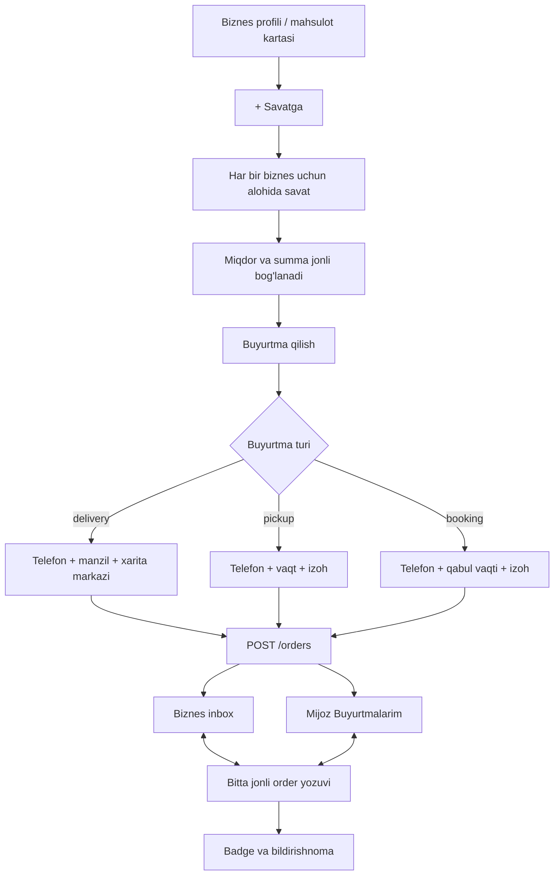
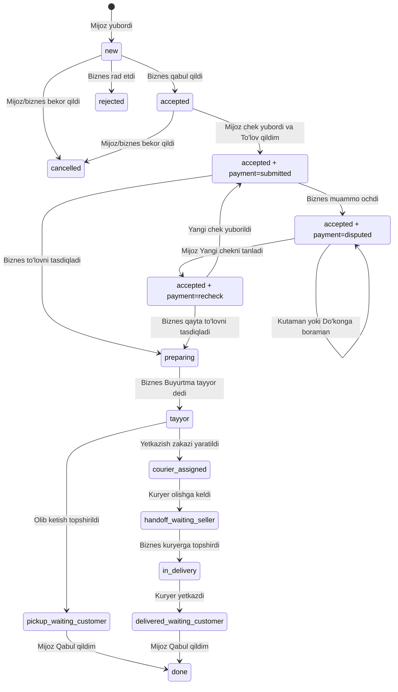

# Buyurtma berish v1656 paritet auditi

Sana: 2026-08-02

Haqiqat manbai: `static/index.html` (`BUILD v1656`), monolit API uchun
`api.py` va SQLite sxemasi uchun `database.py`.

## Audit natijasi

Buyurtma berish tizimi React va modulli backendga to'liq ko'chirilmagan.
Hozirgi kabinetda ayrim kartalar, tablar va mahalliy holat amallari bor, lekin
ular mijoz yaratgan bitta jonli buyurtmani mijoz va biznes tomonda birgalikda
boshqaradigan order domeniga ulanmagan.

O1 backend order core'dan keyingi funksional birliklar holati:
**0 migrated, 12 partial, 2 missing**. Frontend ekranlari keyingi alohida
bloklarda ko'chirilmaguncha biror birlik `migrated` deb oshirib ko'rsatilmaydi.

Holatlar:

- `migrated` — v1656 matni, CSS klassi, xatti-harakati, jonli API va ikki
  tomonlama holat almashinuvi parity testlar bilan ishlaydi;
- `partial` — React ko'rinishi yoki ayrim amal mavjud, ammo to'liq jonli oqim
  va v1656 xatti-harakati yo'q;
- `missing` — maxsus React oqimi, modulli API yoki majburiy test yo'q.

## Audit chegarasi

Ushbu hujjat tashqi mahsulot va xizmat buyurtmasining to'liq zanjirini
qamraydi:

1. ommaviy biznes profili yoki katalogdan buyurtma boshlash;
2. savat va buyurtma formasini to'ldirish;
3. buyurtmani mijoz va biznes kabinetida ko'rish;
4. qabul qilish, to'lov, muammo, tayyorlash, topshirish va qabul qilish;
5. buyurtmaga bog'langan chat, rasmli chek, badge va bildirishnomalar.

Quyidagilar alohida oqim bo'lgani uchun bu auditga qo'shilmaydi:

- stol/xona ichki zakazi — `cab-dining-order`;
- tibbiy yoki xizmat navbati — `cab-medical-queue`;
- kursga yozilish — `cab-education-enrollments`.

Kassa, Ombor va Qarz daftari Tizimlashtirish guruhiga kiradi. Ularga ushbu
migratsiyada kod yozilmaydi. Ular bilan bog'liq monolit yon ta'sirlari quyida
alohida tashqi bog'liqlik sifatida qayd etilgan.

## 14 funksional birlik inventari

| # | Ekran yoki oqim | Holat | Hozirgi React/modulli fayl | Monolit qatorlari | Hozirgi test |
|---:|---|---|---|---|---|
| 1 | Ommaviy profil/katalogdan buyurtma boshlash | partial | `frontend/src/legacy/public/PublicProfileV1656.tsx`; `frontend/src/legacy/public/CatalogItemCard.tsx` | `static/index.html:5684–5825, 8651–8682` | `frontend/src/legacy/public/PublicProfileV1656.test.tsx`; `frontend/src/legacy/public/CatalogItemCard.test.tsx` |
| 2 | Header savat tugmasi, sticky savat va `cart` ekrani | missing | `AppShell.tsx`da ixtiyoriy `onCart`/`cartCount` bor, ammo `App.tsx` ularni uzatmaydi; maxsus savat View yo'q | `static/index.html:1450–1453, 1517, 2954–2956, 5822–5968, 7839–7845, 8861–8884` | Maxsus parity test yo'q; `frontend/src/app/App.test.tsx` hozir `Savat` yo'qligini kutadi |
| 3 | `Buyurtma berish` sheeti va yetkazish xaritasi | missing | Maxsus React komponent yo'q | `static/index.html:6108–6233` | yo'q |
| 4 | Buyurtmani yuborish va savatni tozalash | partial | `backend/app/orders/`da jonli create API bor; `frontend/src/api/client.ts` va savatni tozalash hali O2da | `static/index.html:6234–6263`; `api.py:9916–10013` | `backend/tests/test_orders_live_v1656.py`; frontend testi O2da |
| 5 | Mijoz mahsulot buyurtmalari — `ucab-orders` | partial | `frontend/src/profiles/UserProfile.tsx` umumiy `CabinetDataView` orqali snapshot qatorlarini chiqaradi | `static/index.html:2371, 2714–2715, 6296–6995, 7017–7035` | Maxsus customer-order parity testi yo'q |
| 6 | Mijoz xizmat buyurtmalari — `ucab-service-orders` | partial | `frontend/src/profiles/UserProfile.tsx` faqat umumiy snapshotni `order_type` bo'yicha filtrlaydi | `static/index.html:2372, 2717–2718, 6296–7035` | Maxsus customer-service-order parity testi yo'q |
| 7 | Biznes mahsulot buyurtmalari — `cab-orders` | partial | `frontend/src/profiles/BusinessOnlineScreen.tsx`; `BusinessOnlineViews.tsx` (`OrdersView`) | `static/index.html:1771, 2222–2230, 6296–6995, 7036–7051` | `BusinessExistingOnlineV1656Parity.test.tsx`; `BusinessOnlineClaudeReviewParity.test.tsx`; testlar ko'rinish va snapshot amalini tekshiradi |
| 8 | Biznes xizmat buyurtmalari — `cab-service-orders` | partial | `frontend/src/profiles/BusinessOnlineScreen.tsx`; `BusinessOnlineViews.tsx` (`OrdersView`) | `static/index.html:1772, 2231–2233, 6296–7051` | `BusinessExistingOnlineV1656Parity.test.tsx`; `BusinessOnlineClaudeReviewParity.test.tsx`; jonli ikki tomonlama oqim testi yo'q |
| 9 | Buyurtma tafsiloti, chek va yetkazish metkasi | partial | Backend detail uchun order/item/provider/payment maydonlarini beradi; karta detail ochmaydi va maxsus View O3/O4da | `static/index.html:6301–6499` | `backend/tests/test_orders_live_v1656.py`; frontend testi yo'q |
| 10 | Onlayn to'lov, QR/karta, chek va tasdiqlash | partial | Backend submit/review va R2 `order_chat_image` grantini beradi; maxsus React komponent O3/O4da | `static/index.html:6500–6586`; `api.py:10378–10483` | `backend/tests/test_orders_live_v1656.py`; `backend/tests/test_media_storage.py`; frontend testi yo'q |
| 11 | To'lov muammosi va mijoz yechimi | partial | Backend jonli problem/solution APIga ega; React biznes modali hali snapshot yozuvini o'zgartiradi, mijoz yechim UI O3da | `static/index.html:6275–6278, 6331–6350, 7100–7122`; `api.py:10318–10375` | `backend/tests/test_orders_live_v1656.py`; frontend testi faqat biznes modalini tekshiradi |
| 12 | Buyurtmaga alohida chat | partial | `backend/app/orders/`da orderga bog'langan text/image/reply/edit/soft-delete API bor; React chat View O5da | `static/index.html:6587–6960`; `api.py:10550–10821` | `backend/tests/test_orders_live_v1656.py`; frontend testi yo'q |
| 13 | Order badge, ko'rildi holati va bildirishnomadan detailga o'tish | partial | Backend seen/unread va barqaror outbox hodisalarini beradi; notification consumer, badge va detail deep-link O5da | `static/index.html:6279–6295, 6964–6995, 7531–7704`; `api.py:9618–9808, 10055–10081` | Backend event testi bor; uchdan-uchga frontend testi O5da |
| 14 | Tayyorlash, kuryerga/mijozga topshirish va mijoz qabul tasdig'i | partial | Backend status, pickup handoff, received va delivery statuslarini saqlaydi; React oqimi va delivery adapter O4/O5da | `static/index.html:6328–6376, 7093–7132`; `api.py:10084–10247, 10486–10547` | `backend/tests/test_orders_live_v1656.py`; delivery integratsiya testi O5da |

## v1656 ma'lumot oqimi



Asosiy savat qoidalari:

- har bir biznes uchun alohida chek saqlanadi; turli biznes mahsulotlari
  bitta buyurtmaga aralashmaydi;
- badge jami miqdorni emas, savatdagi turli pozitsiyalar sonini ko'rsatadi va
  `99+` bilan chegaralanadi;
- kilogramm/litr kabi kasrli birliklar `0.5`, sanaladigan birliklar `1`
  qadam bilan o'zgaradi, maksimal miqdor `999`;
- miqdor o'zgarsa summa, summa o'zgarsa miqdor jonli yangilanadi;
- `Chekni tozalash` tasdiqlash oynasidan keyin faqat tanlangan biznes
  savatini tozalaydi;
- muvaffaqiyatli `POST /orders`dan keyin faqat yuborilgan biznes savati
  tozalanadi va `Buyurtma yuborildi.` xabari chiqadi.

Aniq bo'sh holat:

- `Savatcha bo'sh`
- `Do'kon sahifasidan mahsulot qo'shing.`

Bir nechta biznes savati bo'lsa:

- `Har do'kon uchun alohida chek. Har birini alohida buyurtma qilasiz.`

## Yo'nalishga mos buyurtma tugmasi

Monolit `static/index.html:5699–5709` bo'yicha bitta mahsulot kartasi faoliyat
yo'nalishiga qarab uch xil oqimdan faqat bittasini ochadi:

| Shart | Tugma | Oqim |
|---|---|---|
| `Ta'lim faoliyati` va qabul ochiq | `Kursga yozilish` | education enrollment |
| Navbat yoqilgan xizmat | `Navbat olish` | medical/service queue |
| Qolgan mahsulot yoki xizmat | `+ Savatga` | ushbu hujjatdagi order oqimi |

`CAB_PLANS` bo'yicha `Ta'lim faoliyati` biznes kabinetida `cab-orders` va
`cab-service-orders` yashiriladi (`static/index.html:12080–12110,
12140–12177`). Qolgan yo'nalishlarda nom va tavsiflar aynan monolit
matritsasidan olinishi kerak.

## Buyurtma holatlari mashinasi



Qat'iy server qoidalari:

- aktyor o'ziga o'zi buyurtma bera olmaydi;
- buyurtmadagi har bir mahsulot aynan qabul qiluvchi biznesga tegishli
  bo'lishi shart;
- order item nomi, narxi, birlik va jami snapshot sifatida saqlanadi;
- buyurtma `accepted` bo'lmaguncha to'lov ochilmaydi;
- mijoz rasmli chekni order chatiga yubormasdan `To'lov qildim` deya olmaydi;
- to'lov tasdiqlanmasdan `tayyor` yoki yakuniy bosqichga o'tib bo'lmaydi;
- muammo ochiq bo'lsa tayyorlash, yetkazish va yakunlash bloklanadi;
- sotuvchi orderni bevosita `done` qila olmaydi: topshirish va mijozning
  qabul tasdig'i majburiy;
- faqat buyurtmaning mijoz va qabul qiluvchi aktyori detail/chatni ko'ra oladi.

## v1656 API paritet matritsasi

| Monolit endpoint | Vazifa | Modulli backend holati |
|---|---|---|
| `POST /orders` | Buyurtma va item snapshotlarini yaratish | migrated (O1 backend) |
| `GET /orders/my` | Mijoz bergan buyurtmalar | migrated (O1 backend) |
| `GET /orders/inbox` | Biznesga kelgan buyurtmalar | migrated (O1 backend) |
| `PUT /orders/{id}/seen` | Mijoz/biznes unread holatini yopish | migrated (O1 backend) |
| `PUT /orders/{id}/status` | Qabul, rad, bekor, tayyor | migrated (O1 backend) |
| `POST /orders/{id}/problem` | Biznes to'lov muammosini ochadi | migrated (O1 backend) |
| `PUT /orders/{id}/problem/solution` | Mijoz yechim tanlaydi | migrated (O1 backend) |
| `POST /orders/{id}/payment/submit` | Mijoz chekni tekshirishga beradi | migrated (O1 backend) |
| `POST /orders/{id}/payment` | Biznes to'lovni tasdiqlaydi/rad etadi | migrated; qarz amali tashqi bog'liqlik |
| `POST /orders/{id}/handoff` | Biznes qarshi tomonga topshiradi | pickup migrated; delivery adapter O5da |
| `POST /orders/{id}/received` | Mijoz qabul qilib orderni yakunlaydi | migrated; delivery tasdig'i adapteri O5da |
| `GET/POST/PUT/DELETE /orders/{id}/chat...` | Order chat, rasm, reply, edit, soft delete | migrated (O1 backend) |

O1da `backend/app/orders/` paketi va `orders`, `order_items`,
`order_messages` relatsion PostgreSQL modellari qo'shildi. `0009` migratsiya
V7dagi `cabinet_payload`/`cabinet_records` snapshotlarini bitta jonli orderga
idempotent ko'chiradi. Eski generic kabinet amallari yangi domen o'rniga
ishlatilmaydi; O2–O5 frontend bloklari shu APIga navbat bilan ulanadi.

Legacy sxema manbalari:

- `database.py:201–259` — dastlabki `orders`, `order_items`,
  `order_messages`;
- `database.py:827–966` — keyingi ustunlar, muammo, category, indeks va chat
  migratsiyalari;
- `api.py:9501–10821` — tekshirish, ownership, status, payment, problem,
  handoff, received va chat mantig'i.

## To'lov va order chat pariteti

To'lov paneli faqat biznes buyurtmani qabul qilgach va biznesda karta yoki QR
ma'lumoti bo'lsa ko'rinadi (`static/index.html:6512–6563`). Mijozga:

- jami summa va `Summani nusxalash`;
- karta raqami va `Karta raqamini nusxalash`;
- karta egasi va QR;
- `Kvitansiyani yuborish`;
- `To'lov qildim`

ko'rsatiladi. Biznes `To'lovni tasdiqlash` yoki `To'lov bo'yicha muammo`
amalini bajaradi.

Order chat umumiy suhbatlardan alohida. U matn, rasm, rasm preview/viewer,
reply, edit, copy va soft delete'ni qo'llaydi. Mijoz yuborgan so'nggi
o'chirilmagan rasm to'lov cheki hisoblanadi.

## Tashqi bog'liqliklar va qat'iy chegara

Monolitda order oqimi quyidagi boshqa tizimlarga ham ta'sir qiladi:

- `api.py:10230–10242, 10513–10514` — Ombordan chiqim va Kassaga savdo;
- `api.py:10432–10452` — qarzga rasmiylashtirish;
- `api.py:10084–10132, 10494–10516` — delivery order uchun taxi/dostavka
  zakazi va kuryerga topshirish.

Ushbu audit Onlaynlashtirish chegarasini buzmaydi. Migratsiyada order domeni
`order.payment_confirmed`, `order.handed_off`, `order.completed` kabi barqaror
outbox hodisalarini chiqaradi. Kassa, Ombor va Qarz kodiga qator yozilmaydi;
ularning consumerlari o'z Tizimlashtirish migratsiyasida ulanadi. Shu yon
ta'sirlar ulanmaguncha hisobotda ular ochiq tashqi bog'liqlik deb ko'rsatiladi,
`to'liq paritet` deb yashirilmaydi.

Delivery zanjiri ham alohida domen bog'liqligidir. O5 blokida mavjud delivery
domeniga xavfsiz adapter yoki aniq ochiq dependency qo'shiladi; taxi modulini
o'zgartirish uchun alohida ruxsat talab qilinadi.

## Migratsiya modul va papka xaritasi

Backend:

```text
backend/app/orders/
├── __init__.py
├── model.py          # Order, OrderItem, OrderMessage
├── schemas.py        # request/response kontraktlari
├── repository.py     # ownership va atomar DB amallari
├── service.py        # v1656 status mashinasi va biznes qoidalari
├── status.py         # ruxsat etilgan transition jadvali
└── router.py         # /api/v1/orders endpointlari

backend/migrations/versions/0009_orders_live_v1656.py
backend/tests/test_orders_live_v1656.py
backend/tests/test_orders_live_migration.py
```

`0009` raqami `feature/listings-v1656-full`dagi `0008_listings_live_v1656`
avval `main`ga merge qilinishi sharti bilan to'g'ri. O1 boshlanishida Alembic
head qayta tekshiriladi.

Frontend:

```text
frontend/src/orders/
├── CartV1656.tsx
├── OrderCheckoutV1656.tsx
├── OrderLocationMapV1656.tsx
├── CustomerOrdersV1656.tsx
├── BusinessOrdersV1656.tsx
├── OrderDetailV1656.tsx
├── OrderPaymentV1656.tsx
├── OrderProblemV1656.tsx
├── OrderChatV1656.tsx
├── order-store.ts
├── OrdersV1656.css
└── OrdersV1656Parity.test.tsx
```

Ulanadigan mavjud fayllar:

- `frontend/src/app/App.tsx`, `AppShell.tsx` — `cart` route, badge va back;
- `frontend/src/legacy/public/PublicProfileV1656.tsx` — `+ Savatga` va sticky
  savat;
- `frontend/src/legacy/public/CatalogItemCard.tsx` — real order entry;
- `frontend/src/profiles/UserProfile.tsx` — customer order ekranlari;
- `frontend/src/profiles/BusinessOnlineScreen.tsx` — business order ekranlari;
- `frontend/src/api/client.ts`, `types.ts` — typed order API.

Media:

- order chat rasmi va chek uchun `backend/app/media/` ichida
  `order_chat_image` purpose va R2 grant ishlatiladi;
- rasm binary ma'lumoti PostgreSQL yoki cabinet JSON ichiga yozilmaydi.

## Alohida PR bloklari

1. **O0 — Audit:** ushbu hujjat va umumiy Onlaynlashtirish auditidagi
   `cab-orders`/`cab-service-orders` holatini tuzatish. Kod yozilmaydi.
2. **O1 — Backend order core:** PostgreSQL jadvallari, ownership, status
   mashinasi, barcha order API va idempotent legacy backfill.
3. **O2 — Savat va checkout:** ommaviy profil/katalog, per-business savat,
   header/sticky badge, uchta buyurtma turi, xarita va create API.
4. **O3 — Mijoz buyurtmalari:** `ucab-orders`, `ucab-service-orders`, detail,
   map, cancel, payment, receipt, problem solution, received.
5. **O4 — Biznes buyurtmalari:** `cab-orders`, `cab-service-orders`, detail,
   accept/reject, payment review, problem, ready va handoff.
6. **O5 — Order chat, notification, delivery adapter va yakuniy paritet:**
   reply/edit/delete/image, unread/badges, notification deep-link va barcha
   ikki-aktyor integratsiya testlari.

Har blok alohida branch/PRda TDD bilan bajariladi. Keyingi blokka avvalgi PR
merge bo'lib, Claude reviewda jiddiy yoki o'rtacha kamchilik qolmagach o'tiladi.

## Majburiy test matritsasi

- savat bizneslar bo'yicha aralashmasligi;
- kg/litr `0.5`, sanaladigan birlik `1`, maksimum `999`;
- miqdor va summa ikki tomonga jonli sinxronlanishi;
- bo'sh savat va tozalash tasdiqlash oynasi matnlari;
- delivery uchun telefon va xarita markazi majburiyligi;
- `pickup` va `booking`da delivery maydonlari yashirilishi;
- bir aktyorning o'ziga buyurtma berishi bloklanishi;
- begona biznes mahsulotini orderga qo'shish bloklanishi;
- mijoz yaratgan order biznes inboxida aynan bir ID bilan paydo bo'lishi;
- customer/provider ownership va staff permissionlari;
- barcha status transitionlari va noqonuniy o'tishlarning `409` qaytarishi;
- rasmli chek bo'lmasa `To'lov qildim` bloklanishi;
- muammo ochiq bo'lsa ready/handoff/done bloklanishi;
- pickup va delivery handoff zanjirlari;
- order chat text/image/reply/edit/copy/soft-delete;
- notification/badge va detail deep-link;
- eski order/item/message ma'lumotlarining idempotent va dublikatsiyasiz
  backfill qilinishi;
- frontend uchun `npm test`, `npx tsc --noEmit`; backend uchun tegishli
  `pytest` to'liq yashil o'tishi.

## O0 yakuniy holati

Auditdan keyingi hisobot:

`Buyurtma berish: 0/14 funksional birlik migrated, qolgani: 7 partial, 7 missing.`

`Onlaynlashtirish biznes ekranlari: 19/21 migrated, qolgani: cab-orders,
cab-service-orders (partial).`

## O1 yakuniy holati

`Buyurtma berish: 0/14 funksional birlik migrated, qolgani: 12 partial,
2 missing (header/sticky savat va checkout React ekranlari).`

`Onlaynlashtirish biznes ekranlari: 19/21 migrated, qolgani: cab-orders,
cab-service-orders (partial).`
