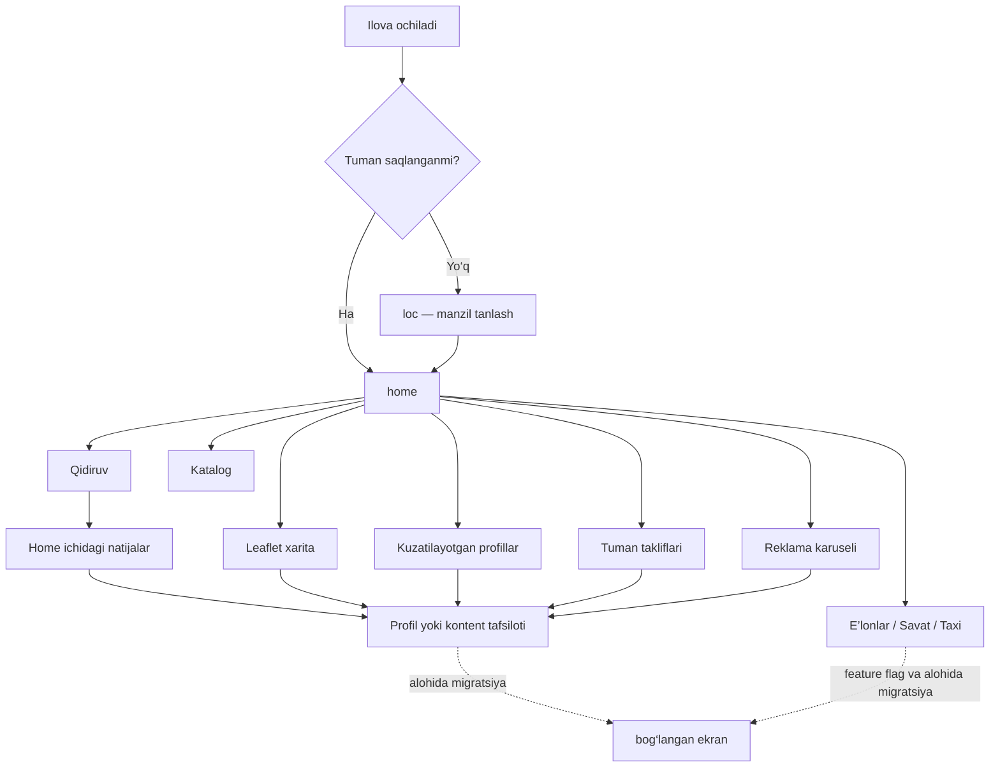

# Bosh sahifa (`home`) — v1656 migratsiya xaritasi

## Holat

`home` ekranining o‘ziga tegishli qidiruv, xarita, kuzatilayotgan profillar,
reklama, tuman takliflari, rang rejimi va birinchi kirishdagi manzil talabi
React stagingga ko‘chirildi. Holat `in-progress`: avtomatik gate yashil
bo‘lgandan keyin ham desktop/mobil qo‘lda qabul talab qilinadi.

Ekrandan ochiladigan `listings`, `cart`, `taxi-call`, biznes/foydalanuvchi
ochiq profili va kontent tafsiloti alohida ekranlardir. Ular ko‘chirilmaguncha
`home`ning ichki qismi tayyor, lekin undan chiqadigan shu oqimlar `partial`
hisoblanadi. Bu hujjat ularni tayyor deb ko‘rsatmaydi.

## v1656 haqiqat manbalari

| Qism | Monolit qatorlari |
| --- | --- |
| Umumiy header | `static/index.html:1429–1472` |
| Home HTML | `static/index.html:1524–1582` |
| Home responsive CSS | `static/index.html:964–1117` |
| Kuzatilayotgan profillar | `static/index.html:3329–3399` |
| Leaflet xarita va markerlar | `static/index.html:3731–3961` |
| Natijalarni qurish va sahifalash | `static/index.html:4660–4756` |
| Navigatsiya va birinchi manzil talabi | `static/index.html:5461–5502` |
| Tuman takliflari | `static/index.html:5553–5677` |
| Home qidiruv tugmalari | `static/index.html:7809–7836` |
| Tanlangan manzilni Home’ga qo‘llash | `static/index.html:8512–8548` |
| Reklama karuseli | `static/index.html:13230–13328` |
| Dastlabki yuklanish | `static/index.html:13981–14086` |

## Ishlaydigan oqim

Qidiruv bo‘sh bo‘lsa katalog ochiladi. Matnli qidiruv natijalari Home ichida
chiqadi; `Yana ko'rsatish` 20 tadan keyingi sahifani qo‘shadi va takroriy
natijalarni olib tashlaydi. Eski so‘rov yangi so‘rovdan keyin tugasa, uning
javobi ekranni almashtirmaydi. Keyingi sahifa xatosida mavjud natijalar qoladi
va v1656 dagi 2,6 soniyalik toast ko‘rinadi.

Xarita foydalanuvchi tanlagan markazdan ochiladi. Unda faqat xaritada
ko‘rinishga ruxsat berilgan va faol Pro obunali yoki kuzatilayotgan bizneslar,
shuningdek kuzatilayotgan ochiq mutaxassislar ko‘rsatiladi. Reklama 10 soniyada
almashadi, 1 soniya xiralashadi, 2 soniya ko‘ringan real reklama view hisobiga
kiradi; beshtagacha view bitta so‘rovda yuboriladi. Reklama topilmasa v1656
dagi beshta demo banner chiqadi.

## React va backend joylashuvi

| Vazifa | Modul |
| --- | --- |
| Ekran va qidiruv holati | `frontend/src/legacy/public/HomeScreen.tsx` |
| Umumiy v1656 header | `frontend/src/legacy/public/PublicHeader.tsx` |
| Reklama karuseli | `frontend/src/legacy/public/HomeAdvertisements.tsx` |
| Kuzatilayotgan profillar | `frontend/src/legacy/public/home/HomeFollowedProfilesV1656.tsx` |
| Leaflet xarita | `frontend/src/legacy/public/home/HomeMapV1656.tsx` |
| Tuman takliflari | `frontend/src/legacy/public/home/HomeDistrictOffersV1656.tsx` |
| Qidiruv kartochkalari | `frontend/src/legacy/public/home/HomeSearchResultsV1656.tsx` |
| v1656 toast | `frontend/src/legacy/public/AppToastV1656.tsx` |
| Matn, klass va responsive CSS | `frontend/src/legacy/public/legacy-public.css` |
| API mijoz kontrakti | `frontend/src/api/client.ts`, `frontend/src/api/types.ts` |
| Public Home API | `backend/app/public_discovery/` |
| Public reklama API | `backend/app/advertisements/` |
| Feature flag javobi | `backend/app/platform/router.py` |

## Ataylab saqlangan xavfsizlik farqi

v1656 umumiy qidiruv javobida aniq `lat/lng` qiymatlarini qaytarib, qidiruv
markerlarini chizadi. Yangi public qidiruv kontrakti shaxsiy aniq
koordinatalarni chiqarmaydi; repository testi `latitude` va `longitude`
ustunlari public projectionga kirmasligini majburiy tekshiradi. Shu sabab Home
qidiruv natijalari ochiq paytda eski markerlar yashiriladi, ammo tanlangan Home
markazi saqlanadi. Bu maxfiylikni pasaytirmaslik uchun qilingan yagona
xavfsizlik cheklovi; matn, klass va qolgan xatti-harakatlar v1656 bo‘yicha
saqlanadi.

## Qabul va keyingi bog‘liqliklar

Avtomatik testlar quyidagilarni qoplaydi: birinchi kirish manzil gate’i,
header tugmalari va feature flaglar, qidiruv/loading/error/stale/pagination,
mobil bir-ekran grid, qorong‘i rang rejimi, markerlar, Pro/kuzatuv filtri,
tuman takliflari, reklama aylanishi va view/click hisoblagichi.

Qo‘lda staging tekshiruvida 390px mobil va kamida 1080px desktop o‘lchamida
manzil tanlash, xaritani surish/zoom, qidiruv, keyingi sahifa, demo/real reklama,
yorug‘/qorong‘i rejim va sahifa yangilanishi tekshiriladi. Bog‘langan ekranlar
navbat bilan migratsiya qilinganda `home`dan ularga o‘tish callbacklari App
navigatsiyasiga ulanadi; undan oldin bu oqimlar qabul qilingan deb belgilanmaydi.
