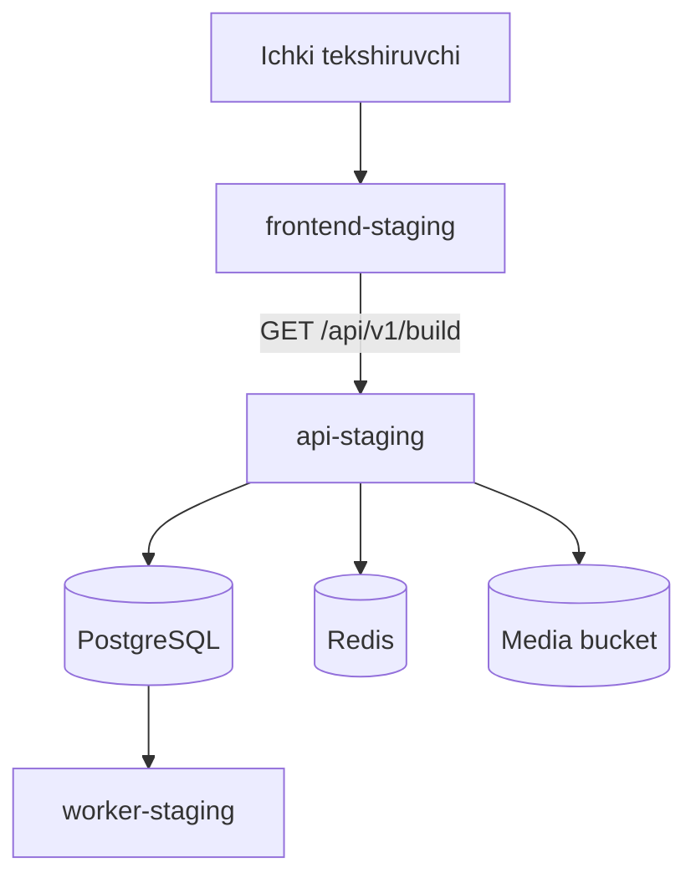

# Ko‘prik `frontend-staging` dizayni

**Sana:** 2026-07-26
**Manba holati:** Ko‘prik MVP v1656 va Phase 1 scalable foundation
**Holat:** foydalanuvchi tomonidan tasdiqlangan

## 1. Maqsad

Production’dagi `web` (`koprik.uz`) xizmatiga tegmasdan, alohida Railway
servisida React frontend foundation’ini ishga tushirish. Birinchi staging
natijasi faqat ichki texnik tekshiruv uchun xizmat qiladi:

- yangi frontend alohida domen orqali ochiladi;
- frontend `api-staging` servisining `/api/v1/build` endpointiga ulanadi;
- sahifa `API v1`, `Phase 1` va faol legacy BUILD `v1656` holatini ko‘rsatadi;
- desktop va mobil brauzerda ishlaydi;
- production trafik, SQLite runtime, `static/index.html` va `koprik.uz`
  o‘zgarmaydi.

Bu bosqich to‘liq v1656 interfeysini ko‘chirmaydi. U keyingi ekranlarni
bo‘limma-bo‘lim ko‘chirish uchun xavfsiz frontend deploy yo‘lini tasdiqlaydi.

## 2. Tanlangan yondashuv

Tanlangan yondashuv — bosqichma-bosqich parallel migratsiya.

1. Mavjud `web` production xizmatida ishlashda davom etadi.
2. `frontend-staging` birinchi bo‘lib texnik foundation sahifasini beradi.
3. Yangi ekranlar faqat staging qabul testidan o‘tgandan keyin navbat bilan
   ko‘chiriladi.
4. Production domen yangi frontendga yakuniy ma’lumot migratsiyasi va yuklama
   testi o‘tgandan keyingina yo‘naltiriladi.

Hammasini birdan ko‘chirish tanlanmadi, chunki u ishlayotgan v1656
jarayonlarini bir vaqtning o‘zida buzish xavfini oshiradi.

## 3. Joriy staging topologiyasi

- `web`: amaldagi `koprik.uz`, Online;
- `api-staging`: FastAPI, Online;
- `worker-staging`: PostgreSQL outbox worker, Online;
- Railway PostgreSQL: Online;
- Railway Redis: Online;
- `koprik media`: S3-compatible bucket;
- API public URL:
  `https://platforma-production-f753.up.railway.app`.

Tekshirilgan readiness natijasi:

```json
{
  "status": "ready",
  "database": true,
  "redis": true,
  "r2_configured": true
}
```

## 4. Arxitektura va ma’lumot oqimi



`frontend-staging` statik React/Vite build bo‘ladi. Brauzer API’ga
cross-origin so‘rov yuboradi. Shu sabab backend faqat aniq ko‘rsatilgan
staging frontend origin’iga CORS javoblarini beradi.

## 5. Backend o‘zgarishi

Backend konfiguratsiyasiga `KOPRIK_CORS_ORIGINS` qo‘shiladi. Qiymat
vergul bilan ajratilgan aniq HTTPS origin’lardan iborat bo‘ladi.

Misol:

```env
KOPRIK_CORS_ORIGINS=https://frontend-staging-example.up.railway.app
```

Qoidalar:

- wildcard (`*`) production yoki staging uchun ishlatilmaydi;
- credentials faqat ro‘yxatdagi origin’larga ruxsat etiladi;
- CORS origin ro‘yxati bo‘sh bo‘lsa, cross-origin ruxsat berilmaydi;
- maxfiy Railway yoki R2 credential frontendga yuborilmaydi;
- `healthz`, `readyz` va API xato formati o‘zgarmaydi.

FastAPI `CORSMiddleware` faqat konfiguratsiyada origin mavjud bo‘lganda
qo‘shiladi. Ruxsat etilgan origin uchun kerakli HTTP metod va headerlar
preflight orqali ishlaydi; noma’lum origin CORS ruxsat headerini olmaydi.

## 6. Frontend deploy dizayni

Railway’da shu GitHub repository’dan yangi `frontend-staging` servis
yaratiladi.

Sozlamalar:

- Root Directory: `/frontend`;
- Build Command: `npm ci && npm run build`;
- Start Command:
  `/bin/sh -c "exec npm run preview -- --host 0.0.0.0 --port $PORT"`;
- `VITE_API_BASE_URL`:
  `https://platforma-production-f753.up.railway.app`;
- Public Networking: Railway-generated HTTPS domain;
- healthcheck: frontend root `/`.

`frontend/package.json` ichida `preview` script aniq e’lon qilinadi. Vite
production build `dist/` katalogiga yozadi. Preview jarayoni Railway bergan
`PORT`ga va `0.0.0.0` hostiga bind qilinadi.

Frontend domeni yaratilgach, aynan shu origin `api-staging` servisidagi
`KOPRIK_CORS_ORIGINS`ga qo‘shiladi va faqat API staging qayta deploy qilinadi.

## 7. UI va xatolik holatlari

Foundation sahifasi mavjud sodda dizaynni saqlaydi:

- yuklanayotganda `Yuklanmoqda…`;
- API javobi kelganda `API v1`, `Phase 1`, `v1656`;
- ulanish xatosida foydalanuvchiga texnik tafsilotsiz
  `Yangi platforma foundation’iga ulanib bo‘lmadi` xabari.

Bu bosqichda login, profil, katalog, qidiruv yoki boshqa v1656 funksiyasi
qo‘shilmaydi.

## 8. Test strategiyasi

### Backend

- konfiguratsiya CORS origin’larini to‘g‘ri ajratadi;
- ruxsat etilgan origin preflight javobini oladi;
- noma’lum origin `Access-Control-Allow-Origin` headerini olmaydi;
- origin ro‘yxati bo‘sh bo‘lsa API avvalgidek ishlaydi.

### Frontend

- mavjud component va API client testlari o‘tadi;
- TypeScript tekshiruvi va Vite production build o‘tadi;
- `VITE_API_BASE_URL` orqali `/api/v1/build` chaqiriladi;
- API xatosi ekranda xavfsiz xabar bilan ko‘rsatiladi.

### Railway acceptance

- `frontend-staging` deployment `ACTIVE` va `Deployment successful`;
- frontend domeni desktop va mobil o‘lchamda ochiladi;
- brauzerda CORS xatosi yo‘q;
- sahifada `API v1`, `Phase 1`, `Eski faol BUILD: v1656` ko‘rinadi;
- `api-staging` `/healthz` va `/readyz` tekshiruvi o‘tadi;
- `worker-staging`, `web`, PostgreSQL va Redis Online qoladi.

## 9. Rollback

Frontend staging production trafikni qabul qilmaydi. Muammo bo‘lsa:

1. `frontend-staging` deployment oldingi versiyaga qaytariladi yoki
   vaqtincha to‘xtatiladi;
2. `api-staging` CORS o‘zgarishi oldingi deploymentga qaytariladi;
3. mavjud `web` va `koprik.uz` o‘zgarishsiz ishlashda davom etadi.

Production ma’lumoti, SQLite runtime va legacy uploadlar bu bosqichda
o‘zgarmaydi.

## 10. Qabul mezonlari va keyingi gate

Ushbu bosqich quyidagi shartlar birga bajarilganda tugagan hisoblanadi:

- GitHub CI yashil;
- backend va frontend test/build tekshiruvlari o‘tgan;
- alohida frontend domen real API staging’ga muvaffaqiyatli ulangan;
- production `koprik.uz` smoke-testdan o‘tgan;
- legacy BUILD `v1656` va `static/index.html` 14 091 qator bo‘lib qolgan.

Shundan keyingi alohida dizayn va implementation cycle — yangi
`identity`/login oqimini staging frontend va backendga ko‘chirish.
