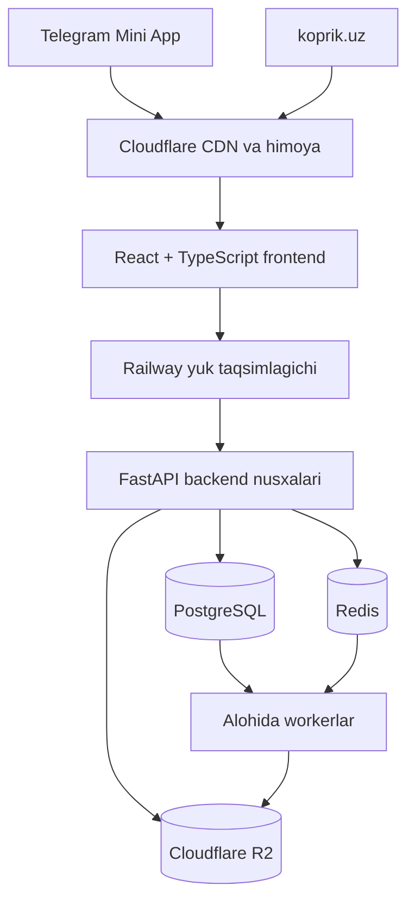

# Ko‘prik: 10 000 faol foydalanuvchi uchun arxitektura dizayni

**Sana:** 2026-07-26  
**Manba holati:** Ko‘prik MVP v1656  
**Holat:** foydalanuvchi tomonidan bo‘limma-bo‘lim tasdiqlangan

## 1. Maqsad

Ko‘prik MVP v1656 loyihasini ishlayotgan funksiyalar va mavjud production
ma’lumotlarini yo‘qotmasdan quyidagi holatga olib kelish:

- Telegram Mini App va `koprik.uz` uchun alohida, responsiv frontend;
- modullarga ajratilgan FastAPI backend;
- PostgreSQL asosiy ma’lumotlar bazasi;
- Redis kesh, sessiya, taqsimlangan limit va real-time yordamchi qatlam;
- Cloudflare R2 media va hujjatlar saqlash xizmati;
- API serveridan alohida fon workerlari;
- Railway’da gorizontal ko‘payadigan backend nusxalari;
- bir vaqtda 10 000 faol foydalanuvchi uchun o‘lchanadigan ishlash mezonlari.

Bu bosqich hozirgi faol MVP funksiyalarini qamrab oladi. Istoriyalar, umumiy
chat, Taxi va tizimlashtirish funksiyalari o‘chirilmaydi, ammo birinchi
migratsiya bosqichida ochilmaydi.

## 2. Tasdiqlangan cheklovlar

- Production bazada saqlanishi shart bo‘lgan haqiqiy foydalanuvchi ma’lumotlari
  mavjud.
- Yakuniy migratsiya vaqtida 1–2 soatlik rejalashtirilgan texnik tanaffus
  mumkin.
- Maqsad jami ro‘yxatdan o‘tgan foydalanuvchilar soni emas, aynan bir vaqtda
  10 000 kishining qidiruv, profil, reklama va buyurtma oqimlaridan
  foydalanishidir.
- Railway asosiy hosting bo‘lib qoladi.
- PostgreSQL va Redis Railway muhitida, media Cloudflare R2’da saqlanadi.
- Telegram Mini App va oddiy veb-sayt ikkalasi ham ishlaydi.
- Telegram Mini App foydalanuvchisi migratsiyadan keyin Telegram orqali
  avtomatik kiradi. Oddiy saytdagi foydalanuvchi bir marta qayta kirishi
  mumkin.
- Ishlayotgan qismlar bosqichma-bosqich ko‘chiriladi; birdaniga to‘liq qayta
  yozish qilinmaydi.

## 3. Joriy holat va asosiy muammolar

Tekshirilgan v1656 manba kodida:

- `static/index.html` — 14 091 qator va taxminan 1 MB;
- `api.py` — 11 134 qator va 244 ta API endpoint;
- `database.py` — 86 ta jadvalni boshqaradi;
- SQLite WAL rejimida ishlaydi;
- production start komandasi bitta Uvicorn worker ishlatadi;
- uploadlar bitta Railway Volume’da saqlanadi;
- chat va ayrim bildirishnomalar 2–3 soniyalik polling ishlatadi;
- Telegram va push workerlar API serveri jarayoni ichida ishga tushadi;
- ayrim limit va keshlar bitta process xotirasida saqlanadi.

Bu holat bitta Railway replica bilan bog‘langan. SQLite bitta yozuvchi
chegarasi, lokal volume, process ichidagi worker va process xotirasidagi
holatlar sabab backend nusxalarini xavfsiz ko‘paytirib bo‘lmaydi.

## 4. Tanlangan migratsiya yondashuvi

Tanlangan yondashuv — bosqichma-bosqich modular migratsiya.

Yangi backend boshida mikroxizmatlar to‘plami bo‘lmaydi. U aniq chegaralangan
modullardan iborat bitta deploy qilinadigan backend bo‘ladi. Backend
nusxalari holatsiz ishlaydi va Railway ularni gorizontal ko‘paytiradi.

Bu yondashuv:

- eski funksiyalarni yangi funksiyalar bilan bosqichma-bosqich solishtirishga;
- ma’lumot migratsiyasini alohida mashq qilishga;
- frontend va backendni mustaqil deploy qilishga;
- keyinchalik faqat real bottleneck bo‘lgan modulni alohida xizmatga
  ajratishga imkon beradi.

Eski `/api/...` kontraktlari migratsiya davrida compatibility qatlam orqali
ishlashda davom etadi. Yangi frontend `/api/v1/...` versiyalangan API
kontraktidan foydalanadi. Eski frontend faqat tegishli yangi ekran qabul
testidan o‘tgandan keyin almashtiriladi.

## 5. Yuqori darajadagi arxitektura



### 5.1 Frontend

- React va TypeScript asosidagi alohida loyiha.
- Telegram Mini App va oddiy brauzer uchun bitta responsiv kod bazasi.
- Ekran va funksiyalar bo‘yicha lazy-loaded modullar.
- Frontend origin Railway servisida deploy qilinadi, Cloudflare esa uning
  oldida CDN, HTTPS va himoya qatlami bo‘lib ishlaydi.
- Hashlangan statik build fayllari Cloudflare orqali uzoq muddat keshlanadi;
  HTML release yangilanishini darhol ko‘rishi uchun qisqa cache siyosati oladi.
- API va media URL’lari muhit sozlamalari orqali beriladi.
- Telegram va veb autentifikatsiyasi bitta frontend auth adapteri ortida
  birlashtiriladi.

### 5.2 Backend

- FastAPI saqlanadi.
- Har bir Railway backend nusxasi holatsiz ishlaydi.
- Sessiya, rate-limit va qisqa muddatli umumiy holat Redis’da bo‘ladi.
- Doimiy biznes ma’lumotlari faqat PostgreSQL’da saqlanadi.
- Backend nusxalari Railway private network orqali PostgreSQL, Redis va
  workerlarga ulanadi.

### 5.3 Workerlar

- Telegram xabarlari;
- push bildirishnomalar;
- media tekshirish va qayta ishlash;
- outbox voqealari;
- muddati tugaydigan reklama, sessiya va boshqa rejalashtirilgan vazifalar.

Worker ishdan chiqishi API javobini to‘xtatmaydi. Muhim vazifa avval
PostgreSQL outbox jadvalida saqlanadi, shundan keyin worker uni bajaradi.

## 6. Backend modul chegaralari

| Modul | Mas’uliyati |
|---|---|
| `identity` | Telegram kirishi, sayt loginlari, sessiyalar, rollar |
| `profiles` | Oddiy foydalanuvchi, biznes va xodim profillari |
| `discovery` | Bosh sahifa, qidiruv, katalog, xarita va hududlar |
| `catalog` | Mahsulot, xizmat va ularning guruhlari |
| `advertising` | Reklama narxi, jadvali, ko‘rsatilishi va statistikasi |
| `commerce` | Buyurtma, holatlar, to‘lov tasdig‘i va buyurtma chati |
| `subscriptions` | Plus/Pro obuna va to‘lov so‘rovlari |
| `notifications` | In-app, Telegram va push bildirishnomalari |
| `moderation` | Shikoyat, kontent tekshiruvi va cheklash |
| `admin` | Admin panel, audit va operator amallari |
| `media` | R2 upload, media metadata va kirish ruxsatlari |
| `platform` | Feature flag, healthcheck, umumiy konfiguratsiya |

Har bir modul:

- o‘z router, service va repository qatlamiga ega;
- boshqa modul jadvaliga to‘g‘ridan-to‘g‘ri SQL yozmaydi;
- umumiy contract yoki service interfeysi orqali muloqot qiladi;
- mustaqil unit va integration testga ega.

## 7. Ma’lumotlar bazasi dizayni

PostgreSQL barcha doimiy ma’lumotlar uchun yagona manba bo‘ladi.

- Eski SQLite `id` qiymatlari migratsiyada saqlanadi.
- Pul qiymatlari kasrsiz UZS birligida `BIGINT` ko‘rinishida saqlanadi.
- Vaqtlar UTC va timezone-aware timestamp sifatida saqlanadi.
- Reklama nishonlari va o‘zgarmas narx snapshotlari kerakli joyda `JSONB`
  ishlatadi.
- Foreign key, unique va check cheklovlari bazada majburiy qilinadi.
- Qidiruv, buyurtma, reklama, bildirishnoma va audit oqimlariga mos kompozit
  indekslar haqiqiy query-plan o‘lchovi asosida qo‘yiladi.
- Transaction talab qiladigan buyurtma, to‘lov va obuna o‘zgarishlari bitta
  database transaction ichida bajariladi.
- Takroriy POST so‘rovlarini zararsiz qilish uchun muhim write endpointlar
  `idempotency key` qabul qiladi.

PostgreSQL ulanishlari pool orqali chegaralanadi. 10 000 faol foydalanuvchi
10 000 ta bevosita database connection yaratmaydi.

## 8. SQLite’dan PostgreSQL’ga migratsiya

### 8.1 Oldindan bajariladigan ishlar

1. Production backup nusxasida migratsiya skripti takroran bajariladi.
2. Har jadval uchun ustun, tur, default, constraint va indeks xaritasi
   aniqlanadi.
3. Migratsiya va rollback runbook staging muhitida mashq qilinadi.
4. Media fayllar R2’ga oldindan nusxalanadi va checksum bilan tekshiriladi.

### 8.2 Yakuniy cutover

1. Sayt texnik rejimga o‘tkaziladi va yangi write so‘rovlari to‘xtatiladi.
2. SQLite online backup va integrity check bajariladi.
3. Upload katalogining yakuniy nusxasi olinadi.
4. Qolgan yangi media R2’ga ko‘chiriladi.
5. SQLite jadvallari dependency tartibida PostgreSQL’ga import qilinadi.
6. Sequence qiymatlari eng katta saqlangan `id`dan keyingi qiymatga
   o‘rnatiladi.
7. Tekshiruvlar bajariladi.
8. Backend `DATABASE_URL` PostgreSQL’ga o‘tkaziladi.
9. Smoke test muvaffaqiyatli bo‘lsa, yangi frontend ochiladi.

### 8.3 Majburiy tekshiruvlar

- har bir jadvaldagi yozuvlar soni;
- asosiy jadvallarning deterministik checksum natijasi;
- orphan foreign key yo‘qligi;
- user–business–order bog‘lanishlari;
- reklama va obuna muddatlari;
- to‘lov summalari, holatlari va audit voqealari;
- R2 obyektlari mavjudligi va checksum mosligi;
- muhim query va write oqimlarining smoke testi.

### 8.4 Rollback

Tekshiruvdan biri muvaffaqiyatsiz bo‘lsa production ochilmaydi. Yangi backend
to‘xtatiladi, eski konfiguratsiya qaytariladi va o‘zgartirilmagan SQLite backup
bilan eski release ishga tushiriladi. Eski SQLite va upload backup kamida
30 kun saqlanadi.

## 9. Kesh va real-time oqim

Redis quyidagilar uchun ishlatiladi:

- qisqa muddatli bosh sahifa va hududiy reklama keshi;
- qidiruvning xavfsiz keshlanadigan natijalari;
- sessiya va taqsimlangan rate-limit;
- WebSocket connection registry;
- replica’lar orasida tez real-time fan-out.

Redis Pub/Sub muhim voqeaning yagona nusxasi bo‘lmaydi. Buyurtma, to‘lov,
obuna va muhim bildirishnoma avval PostgreSQL transaction va outbox’da
saqlanadi. Redis faqat tez yetkazish uchun ishlatiladi. Zarur worker oqimlari
Redis Streams consumer group yoki PostgreSQL outbox locking orqali
qayta urinadigan qilib quriladi.

Hozirgi 2–3 soniyalik chat va action-notification polling WebSocket’ga
almashtiriladi. Client:

- uzilishdan keyin exponential backoff bilan qayta ulanadi;
- oxirgi qabul qilingan event identifikatorini yuboradi;
- o‘tkazib yuborilgan voqealarni HTTP sync endpoint orqali oladi;
- WebSocket ishlamasa sekinlashtirilgan fallback sync ishlatadi.

## 10. Media va R2

- Ochiq reklama va profil medialari public delivery qatlamidan beriladi.
- To‘lov cheki, hujjat va yopiq media private bucket/prefix’da saqlanadi.
- Frontend backenddan qisqa muddatli presigned upload URL oladi va faylni
  to‘g‘ridan-to‘g‘ri R2’ga yuklaydi.
- Backend fayl egasi, MIME turi, ruxsat etilgan hajm va yakuniy object
  metadata’ni tasdiqlaydi.
- R2 credential frontendga hech qachon berilmaydi.
- Media database yozuvi upload tasdiqlanmaguncha `pending` holatda turadi.
- Yetim qolgan incomplete uploadlar rejalashtirilgan worker orqali
  tozalanadi.

## 11. Autentifikatsiya va xavfsizlik

- Telegram Mini App init data imzosi, muddati va bot identifikatori
  backendda tekshiriladi.
- Veb sessiya `HttpOnly`, `Secure` va mos `SameSite` cookie orqali beriladi.
- Access sessiya qisqa muddatli; yangilash va revoke holati server tomonida
  boshqariladi.
- `user`, `business`, `staff` va `admin` vakolati har bir endpointda
  backend policy orqali tekshiriladi.
- Rate-limit replica xotirasida emas, Redis’da umumiy saqlanadi.
- Login, to‘lov, admin va upload endpointlariga kuchaytirilgan limit
  qo‘llanadi.
- Sirlar faqat Railway Variables’da saqlanadi.
- Admin va moliyaviy amallar immutable audit voqeasi yaratadi.
- Foydalanuvchiga stack trace yoki maxfiy ichki tafsilot qaytarilmaydi.

## 12. Xatoliklarni boshqarish va kuzatuv

API xatolari bir xil shaklda qaytadi:

```json
{
  "code": "machine_readable_code",
  "message": "Foydalanuvchi uchun o‘zbekcha xabar",
  "request_id": "trace-identifikator"
}
```

- Har HTTP va WebSocket aloqasi request/connection identifikatoriga ega.
- Loglar JSON formatida environment, service, replica, actor turi va
  request identifikatori bilan yoziladi; maxfiy token va shaxsiy ma’lumot
  maskalanadi.
- Markaziy error tracking exception va trace kontekstini yig‘adi.
- Railway metrics orqali CPU, RAM, restart va replica ko‘rsatkichlari
  kuzatiladi.
- `/healthz` process tirikligini tekshiradi.
- `/readyz` PostgreSQL va Redis ulanishi, migratsiya versiyasi va majburiy
  konfiguratsiyani tekshiradi.
- Alertlar error rate, p95 latency, database pool saturation, worker backlog,
  WebSocket connection va failed outbox soni uchun o‘rnatiladi.
- PostgreSQL backup va restore mashqi muntazam bajariladi.

## 13. Ishlash va yuklama qabul mezonlari

Staging production’ga o‘xshash topologiyada sinovdan o‘tadi.

Yuklama profili:

- 10 000 virtual foydalanuvchi bosqichma-bosqich ulanadi;
- 30 daqiqalik barqaror yuk;
- qidiruv, bosh sahifa, xarita, reklama, profil, katalog, buyurtma read/write
  va real-time voqealari aralashmasi;
- alohida qisqa burst sinovi;
- bitta backend replica’ni o‘chirish sinovi.

Qabul mezonlari:

- server va tarmoq xatolari 0,5% dan kam;
- oddiy API so‘rovlarining p95 vaqti 1 soniyadan tez;
- statik frontend va CDN media javobi API mezoniga qo‘shilmaydi, alohida
  o‘lchanadi;
- buyurtma, to‘lov va obuna write’lari yo‘qolmaydi yoki takrorlanmaydi;
- worker qayta ishga tushganda pending outbox davom ettiriladi;
- bitta backend replica o‘chirilganda xizmat ishlashda davom etadi;
- database pool va worker backlog belgilangan xavfsiz chegaradan oshmaydi.

Bu mezonlar bajarilmasa production cutover qilinmaydi. Bottleneck o‘lchanadi,
indeks, kesh, query yoki replica soni tuzatiladi va test qayta bajariladi.

## 14. Test strategiyasi

1. **Unit test:** domain qoidalari, narx, status o‘tishlari va policy.
2. **Repository integration:** real PostgreSQL va Redis bilan query,
   transaction va locking.
3. **API contract:** eski v1656 faol endpoint natijasi va yangi endpoint
   semantikasi solishtiriladi.
4. **Migration test:** schema, count, checksum, constraint, sequence va media.
5. **Frontend component test:** ekran holatlari va validation.
6. **End-to-end:** Telegram Mini App va oddiy veb uchun asosiy foydalanuvchi,
   biznes va admin oqimlari.
7. **Security test:** auth bypass, role escalation, rate-limit, upload va
   admin amallari.
8. **Load test:** 10 000 faol foydalanuvchi va failure injection.

Har modul keyingi bosqichga faqat o‘z testlari va avvalgi barcha regression
testlari o‘tgandan keyin o‘tadi.

## 15. Ishlab chiqish va release ketma-ketligi

1. v1656 funksional baseline va API kontraktlarini muzlatish.
2. Yangi repository/workspace tuzilmasi va CI.
3. PostgreSQL, Redis, R2 va worker foundation.
4. `identity` va `profiles`.
5. `discovery` va `catalog`.
6. `advertising`, `subscriptions` va to‘lovlar.
7. `commerce`, order chat va `notifications`.
8. `moderation` va `admin`.
9. React frontend ekranlarini birma-bir almashtirish.
10. To‘liq migration rehearsal.
11. 10 000 foydalanuvchi yuklama va failure sinovlari.
12. Rejalashtirilgan production cutover.
13. 48 soat kuchaytirilgan monitoring.

## 16. Production ochilishining yakuniy shartlari

- faol MVP funksiyalari E2E testdan o‘tgan;
- SQLite va PostgreSQL majburiy tekshiruvlari 100% mos;
- media migratsiyasi to‘liq va tekshirilgan;
- 10 000 foydalanuvchi yuklama mezonlari bajarilgan;
- critical yoki high darajadagi ochiq xavfsizlik topilmasi yo‘q;
- rollback staging’da amalda sinab ko‘rilgan;
- monitoring, alert, backup va runbook tayyor;
- production ochishga mas’ul shaxs yakuniy checklistni tasdiqlagan.

## 17. Ushbu bosqichga kirmaydigan ishlar

- Istoriyalarni qayta ochish;
- umumiy foydalanuvchilar chatini qayta ochish;
- Taxi oqimini qayta ochish;
- tizimlashtirish modullarini yangi arxitekturaga ko‘chirish;
- o‘lchovsiz ravishda alohida mikroxizmatlar yaratish;
- MVP faoliyatiga bog‘liq bo‘lmagan dizayn yoki funksional o‘zgarishlar.

Bu funksiyalar asosiy platforma barqarorlashgandan keyin alohida
spetsifikatsiya, reja va qabul mezonlari bilan ko‘chiriladi.

## 18. Rasmiy texnik tayanchlar

- Railway horizontal scaling va replica’lar:
  <https://docs.railway.com/deployments/scaling>
- Railway private networking:
  <https://docs.railway.com/networking/private-networking>
- Railway metrics:
  <https://docs.railway.com/observability/metrics>
- Cloudflare R2 presigned URL:
  <https://developers.cloudflare.com/r2/api/s3/presigned-urls/>
- Redis Pub/Sub delivery semantics:
  <https://redis.io/docs/latest/develop/pubsub/>
- Redis Streams:
  <https://redis.io/docs/latest/develop/data-types/streams/>
- FastAPI WebSocket:
  <https://fastapi.tiangolo.com/advanced/websockets/>
