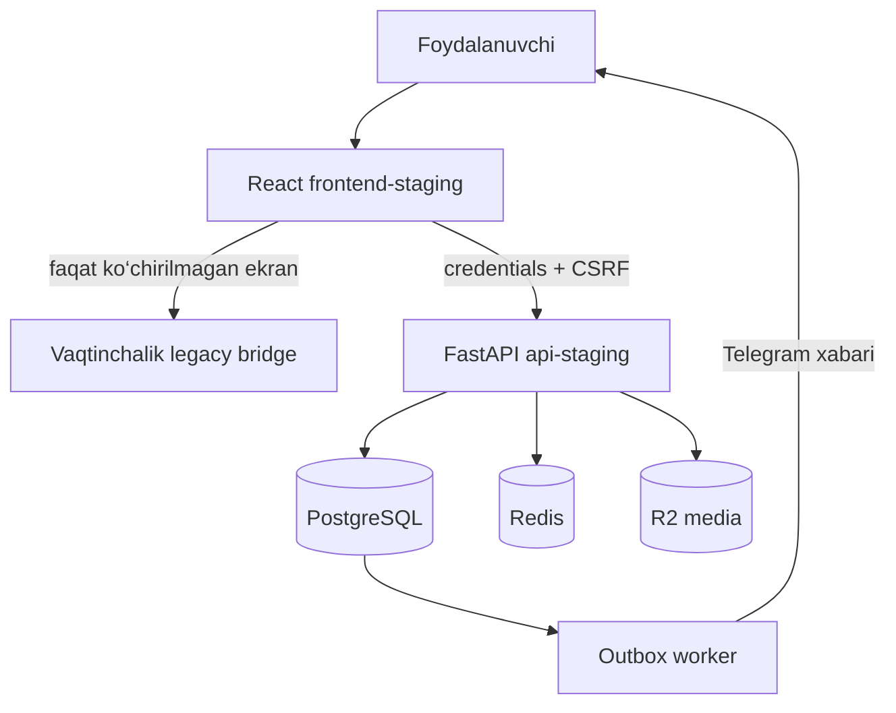

# Koprik Phase 3: mavjud interfeysni yangi platformaga integratsiya qilish

**Sana:** 2026-07-28
**Holat:** foydalanuvchi ko‘rib chiqishi uchun
**Muhit:** avval staging, keyin nazoratli production cutover
**Asos:** BUILD v1656, Phase 1 foundation va Phase 2 autentifikatsiya/profil

## 1. Maqsad

Phase 3 maqsadi — hozir `koprik.uz` da ishlayotgan to‘liq BUILD v1656
interfeysini va foydalanuvchi oqimlarini saqlagan holda, ularni yangi
ajratilgan platformaga bosqichma-bosqich ulash:

- React/Vite frontend;
- FastAPI backend;
- PostgreSQL;
- Redis;
- R2 media saqlash;
- outbox worker.

Yakuniy natijada foydalanuvchi alohida texnik staging sahifasini emas,
o‘zi bilgan Koprik interfeysini ko‘radi. Login, Telegram tasdiqlash,
sessiya, oddiy kabinet va biznes kabinet yangi Phase 2 API’lari orqali
ishlaydi.

## 2. Asosiy cheklovlar

- Amaldagi `web` xizmati va `koprik.uz` Phase 3 qabul sinovlari
  tugamaguncha o‘zgarmaydi.
- `static/index.html` ichidagi 14 mingdan ortiq qatorli monolit birdaniga
  qayta yozilmaydi.
- BUILD v1656 funksiyalari yo‘qotilmaydi yoki yashirincha soddalashtirilmaydi.
- Railway sir qiymatlari, Telegram tokeni, R2 kalitlari va sessiya
  tokenlari frontend kodiga yoki GitHub’ga yozilmaydi.
- Har bir ko‘chirilgan ekran alohida staging qabul sinovidan o‘tadi.
- Production domen faqat rollback tayyor bo‘lgandan keyin ko‘chiriladi.

## 3. Tanlangan yondashuv

Tanlangan yondashuv — **bosqichma-bosqich strangler migratsiya**.

1. Mavjud `web` production xizmati xavfsiz rollback sifatida ishlashda
   davom etadi.
2. `frontend-staging` ichida v1656 ko‘rinishiga mos umumiy qobiq,
   navigatsiya va dizayn tokenlari yaratiladi.
3. Avval Phase 2 ga tegishli login, Telegram kodi va profil kabinetlari
   to‘liq integratsiya qilinadi.
4. Keyin v1656 ekranlari bog‘liqliklari bilan birga navbatma-navbat
   React frontendga ko‘chiriladi.
5. Ko‘chirilmagan funksiyalar uchun vaqtinchalik moslik qatlami ishlaydi;
   foydalanuvchi oqimi uzilmaydi.
6. Vizual va funksional parity tasdiqlangach, `koprik.uz` yangi frontendga
   yo‘naltiriladi.

Bu yondashuv monolitni bitta katta o‘zgarishda almashtirishdan ko‘ra
kichik, tekshiriladigan va qaytariladigan release’lar beradi.

## 4. Phase 3 doirasi

### 4.1. Legacy inventar va parity xaritasi

`static/index.html` dagi ekranlar, hodisalar, API chaqiruvlari, saqlash
kalitlari va media oqimlari inventar qilinadi. Kamida quyidagi guruhlar
xaritaga kiritiladi:

- bosh sahifa, qidiruv, katalog va lokatsiya;
- xarita, tuman takliflari, e’lonlar va taksi;
- login, ro‘yxatdan o‘tish va Telegram tasdiqlash;
- oddiy foydalanuvchi kabineti;
- biznes kabineti;
- obuna, to‘lov, sharh, buyurtma va e’lon bo‘limlari;
- mavjud yo‘nalish modullari va admin/staff oqimlari.

Har bir ekran uchun “mavjud”, “stagingga ko‘chirilgan”, “qabul qilingan”
yoki “keyingi bosqichga qoldirilgan” holati yuritiladi.

### 4.2. Umumiy frontend qobig‘i

React frontend v1656’dagi foydalanuvchiga tanish qiyofani saqlaydi:

- Koprik brendi va yozilishi;
- ranglar, shrift masshtabi, tugmalar va forma elementlari;
- desktop va mobil joylashuv;
- header, navigatsiya, qaytish va chiqish oqimlari;
- loading, bo‘sh holat va xavfsiz xato xabarlari.

Yangi qobiq ichida route va sessiya holati markazlashadi. Bir ekran
ichida qo‘lda DOM almashtirish o‘rniga React route/component chegaralari
ishlatiladi.

### 4.3. Phase 2 autentifikatsiya integratsiyasi

Quyidagi ishlayotgan API oqimlari v1656 ko‘rinishidagi sahifalarga ulanadi:

- akkaunt turini tanlash;
- oddiy va biznes ro‘yxatdan o‘tishi;
- Telegram botni ochish va 6 xonali kodni tasdiqlash;
- login/parol bilan kirish;
- login orqali akkaunt turini avtomatik aniqlash;
- 30 kunlik sessiyani tiklash;
- CSRF bilan holat o‘zgartiruvchi so‘rovlar;
- chiqish va sessiyani bekor qilish.

Frontend maxfiy sessiya tokenini o‘qimaydi. Cookie `Secure` va `HttpOnly`
bo‘lib qoladi. Frontend akkaunt turini `/api/v1/me` orqali aniqlaydi.

### 4.4. Profil va media integratsiyasi

Oddiy va biznes kabinetlari quyidagi Phase 2 endpointlariga ulanadi:

- `GET/PUT /api/v1/user-profile`;
- `GET/PUT /api/v1/business-profile`;
- `GET /api/v1/me`;
- `/api/v1/media/*`;
- avatar va logotipni profilga biriktirish endpointlari.

Saqlangan maydonlar qayta kirganda PostgreSQL’dan tiklanadi. Avatar va
logotip R2’da saqlanadi; PostgreSQL’da faqat tegishli object key va
kesim metadata’si turadi. Redis profil summary cache’i yangilanishdan
keyin xavfsiz invalidatsiya qilinadi.

### 4.5. Legacy moslik qatlami

Phase 3 davomida hali Reactga ko‘chirilmagan v1656 funksiyalari uchun
aniq chegaralangan adapter ishlatiladi. Adapter:

- eski endpoint va yangi API formatlari o‘rtasidagi ma’lumotni o‘giradi;
- route va akkaunt kontekstini yo‘qotmaydi;
- faqat zarur eski modulni chaqiradi;
- yangi auth token yoki sirlarni eski global JavaScriptga bermaydi;
- telemetriyada qaysi legacy funksiya ishlatilganini ajratib ko‘rsatadi.

Adapter doimiy arxitektura emas. Parity xaritasidagi ekran ko‘chirilgach,
unga tegishli adapter olib tashlanadi.

## 5. Komponent chegaralari

| Qatlam | Mas’uliyat |
| --- | --- |
| `app-shell` | route, layout, session bootstrap va global xatolar |
| `auth` | register, login, Telegram challenge va logout |
| `profiles` | oddiy/biznes profil formasi va profil cache bilan ishlash |
| `media` | upload grant, R2 upload, preview va profilga biriktirish |
| `legacy-bridge` | hali ko‘chirilmagan v1656 oqimlari uchun vaqtinchalik adapter |
| `api/client` | typed request, credentials, CSRF, timeout va xato formati |
| backend modullari | PostgreSQL tranzaksiyasi, ruxsat, Redis va outbox |

Frontend backend jadvallarini yoki Railway servis nomlarini bilmaydi.
Backend esa UI navigatsiyasini boshqarmaydi.

## 6. Ma’lumot oqimi

## 7. Yetkazib berish ketma-ketligi

### Gate A — inventar va kontraktni muzlatish

- v1656 ekran va API xaritasi;
- kritik foydalanuvchi oqimlari uchun smoke kontraktlar;
- staging va production parity checklist;
- mavjud `web` xizmatiga tegilmaganini tekshirish.

### Gate B — vizual qobiq va navigatsiya

- v1656 ko‘rinishidagi responsive app shell;
- route, back va session bootstrap;
- loading, error va offline holatlari;
- desktop va mobil screenshot parity.

### Gate C — autentifikatsiya

- register, login, Telegram deep-link va kod;
- sessiyani tiklash va logout;
- ordinary/business turini avtomatik ochish;
- noto‘g‘ri kod, tugagan challenge va rate-limit holatlari.

### Gate D — profil va media

- oddiy va biznes kabinet parity;
- barcha Phase 2 maydonlari;
- avatar/logotip upload va qayta ochilganda ko‘rinishi;
- cache invalidatsiyasi va ruxsat tekshiruvi.

### Gate E — legacy ekranlarni navbat bilan ko‘chirish

Ustuvor tartib:

1. bosh sahifa, qidiruv, katalog va lokatsiya;
2. biznes/foydalanuvchi public sahifalari;
3. e’lon, buyurtma, obuna va to‘lov oqimlari;
4. yo‘nalish modullari;
5. staff/admin oqimlari.

Har bir guruh alohida PR va alohida qabul gate’iga ega bo‘ladi.

### Gate F — staging qabul va production cutover

- avtomatik backend/frontend testlari;
- kritik oqimlar uchun end-to-end smoke;
- desktop/mobil regressiya;
- staging media, Redis va worker tekshiruvi;
- backup va rollback rehearsal;
- nazoratli domen yo‘naltirish.

## 8. Xatolar va tiklanish

- API xatosi yagona `code`, `message`, `request_id` formati bilan
  ko‘rsatiladi.
- `401` bo‘lsa sessiya qayta tekshiriladi va zarur bo‘lsa login ochiladi.
- `403` akkaunt turi yoki ruxsat xatosi sifatida ko‘rsatiladi.
- `409` takroriy login/username yoki parallel yangilanishni bildiradi.
- `422` forma maydoni yonida tushunarli validatsiya beradi.
- `429` qayta urinish vaqtini ko‘rsatadi.
- `5xx` da foydalanuvchiga sir tafsilotlari berilmaydi; `request_id`
  kuzatuv uchun saqlanadi.
- R2 upload tugab, profilga biriktirish ishlamasa, foydalanuvchi qayta
  urina oladi; yarim yozilgan profil yaratilmaydi.

## 9. Test va qabul mezonlari

### Avtomatik tekshiruv

- backend unit/integration testlari yashil;
- frontend unit/component testlari yashil;
- TypeScript va production build yashil;
- v1656 legacy contract testlari yashil;
- auth, session, profil va media smoke testlari yashil;
- ko‘chirilgan route’lar uchun browser end-to-end testlari yashil.

### Qo‘lda qabul

- foydalanuvchi v1656’ga tanish Koprik bosh sahifasini ko‘radi;
- desktop va mobil ekranlarda navigatsiya buzilmaydi;
- yangi va mavjud staging akkauntlar login qila oladi;
- Telegram kodi bir marta keladi va tasdiqlanadi;
- chiqishdan keyin yopiq kabinetga kirib bo‘lmaydi;
- oddiy va biznes profil alohida saqlanadi;
- avatar/logotip qayta kirganda ham ko‘rinadi;
- hali ko‘chirilmagan kritik v1656 bo‘limi ishlashda davom etadi;
- `web`, PostgreSQL, Redis, R2 va worker rollback vaqtida xavfsiz qoladi.

### Performance acceptance

Phase 2’da qabul qilingan staging bazasi regressiya qilmasligi kerak:

- test davomida kutilmagan `5xx` xatolar bo‘lmaydi;
- 100 parallel o‘qishda p95 500 ms dan oshmaydi;
- 500 va 1000 parallel o‘qishda p95 1 soniyadan oshmaydi;
- bu mezon 10 000 bir vaqtdagi foydalanuvchi kafolati hisoblanmaydi.

Frontend route va asosiy sahifa yuklanishi alohida o‘lchanadi. Railway
regioniga tashqi internet kechikishi server ichki ishlashidan ajratiladi.

## 10. Production cutover va rollback

Cutover oldidan:

1. production backup olinadi va tiklash usuli tekshiriladi;
2. staging acceptance imzolanadi;
3. eski `web` deployment identifikatori yozib olinadi;
4. frontend/API environment qiymatlari tekshiriladi;
5. domen TTL va kuzatuv oynasi kelishiladi.

Cutover vaqtida trafik yangi frontendga yo‘naltiriladi. `web` darhol
o‘chirilmaydi. Kritik smoke test muvaffaqiyatsiz bo‘lsa, domen eski
`web` xizmatiga qaytariladi. Ma’lumot modeli o‘zgarishi backward
compatible bo‘lmaguncha eski deploymentni tiklashga to‘sqinlik qiladigan
migratsiya bajarilmaydi.

## 11. Phase 3 doirasiga kirmaydi

- 10 000+ bir vaqtdagi foydalanuvchini rasman sertifikatlash;
- ko‘p regionli deployment va pullik replica’larni majburiy yoqish;
- SMS, OneID yoki boshqa yangi login usuli;
- yangi to‘lov provayderi;
- v1656’da mavjud bo‘lmagan yangi yo‘nalish funksiyalari;
- barcha legacy kodni bitta release’da olib tashlash.

Ular alohida dizayn va qabul mezoniga ega keyingi bosqichlardir.

## 12. Phase 3 yakuniy gate

Phase 3 faqat quyidagilar birga bajarilganda yopiladi:

- yangi frontend v1656’ning kelishilgan kritik ekranlari va ko‘rinishini
  saqlaydi;
- Phase 2 auth, session, ordinary/business profile va media oqimlari
  yangi interfeys ichida ishlaydi;
- kelishilgan legacy funksiyalar regressiyasiz ishlaydi;
- staging avtomatik va qo‘lda qabul testlaridan o‘tadi;
- backup va rollback amalda tekshiriladi;
- production cutover muvaffaqiyatli bo‘ladi;
- kuzatuv oynasida kritik xato aniqlanmaydi.
